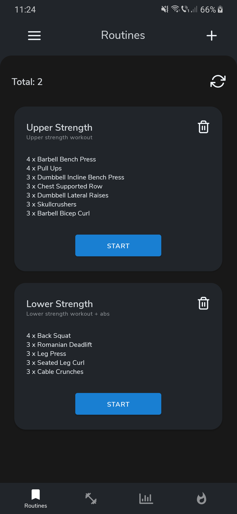
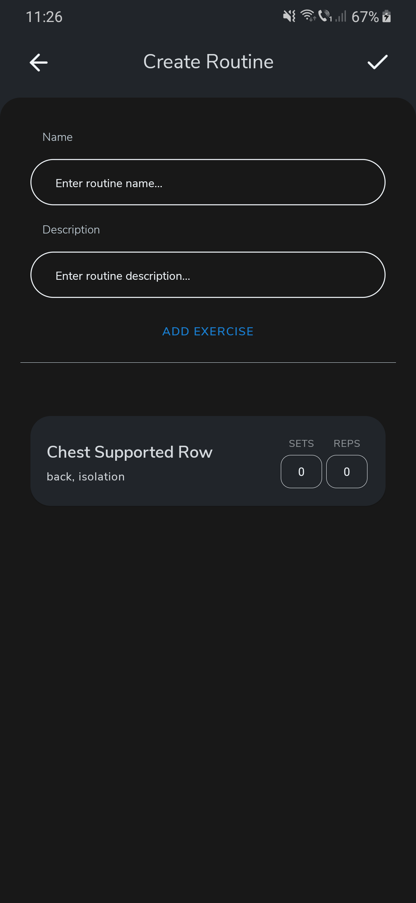
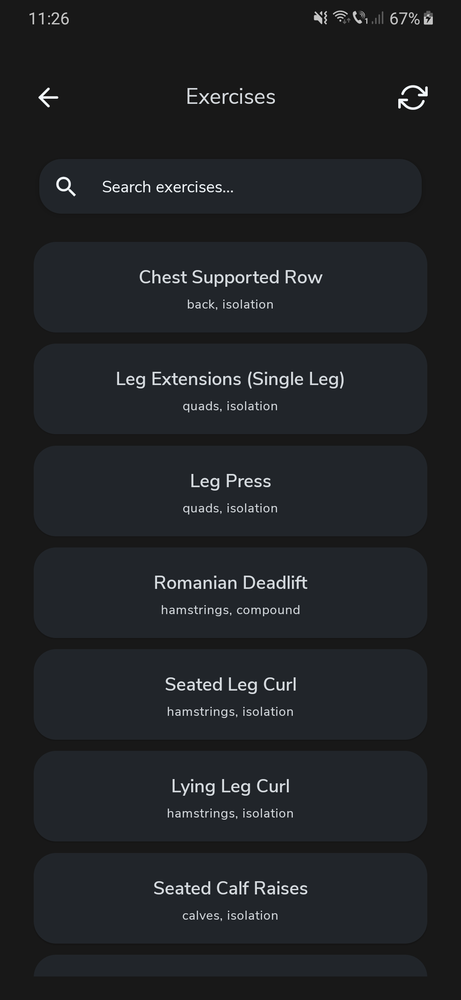
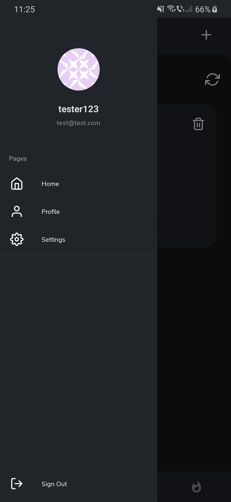
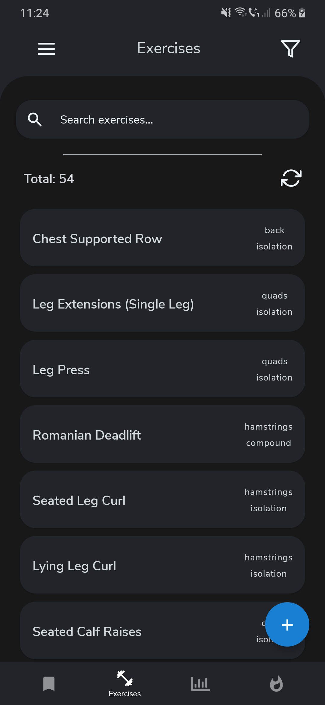
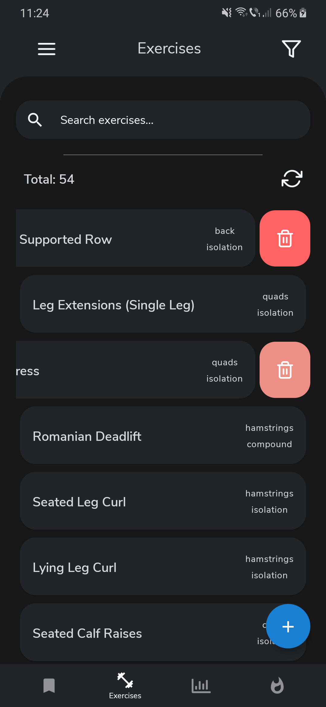

# 
FitR

This is a workout tracking application built with react native.  
It uses a custom Express backend which you can find [here](https://github.com/bboti199/trackr-api) and firebase for handling user sessions and authentication.  
Currently it only supports Android and it is not complete yet.

## TODOS:
- [x] Implement routine and exercise creation.
- [x] Delete routines and exercises.
- [ ] Update routines and exercises.
- [ ] Implement exercise filtering.
- [ ] Implement progress tracking.
- [ ] Implement logging.
- [ ] Light mode switch.