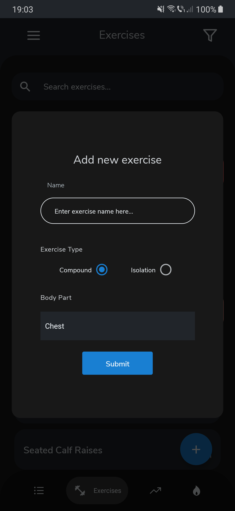
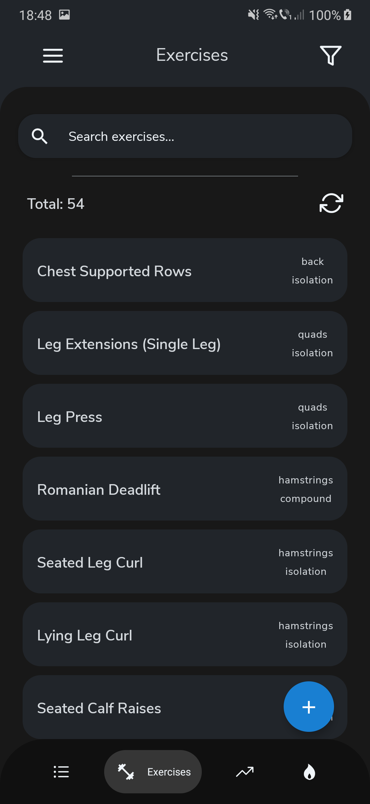

  
  <h1 align="middle">FitR</h1>
 

This is a workout tracking application built with react native.  
It uses a custom express backend which you can find [here](https://github.com/bboti199/fitr-api-ts) and firebase for handling user sessions and authentication.  
Currently it only supports Android and it is not complete yet.

## TODOS:
- [x] Implement routine and exercise creation.
- [x] Delete routines and exercises.
- [x] Update routines.
- [x] Implement progress tracking.
- [x] Implement logging.
- [x] Move chart data extraction to server side.
- [ ] Implement exercise filtering.
- [ ] Light mode switch.
